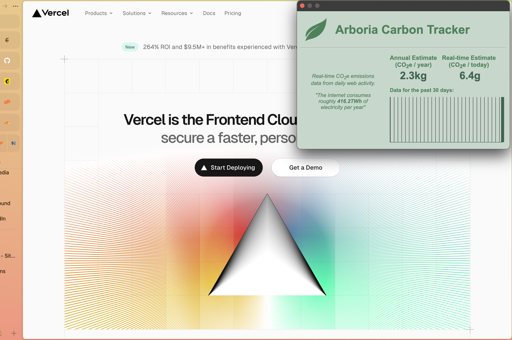
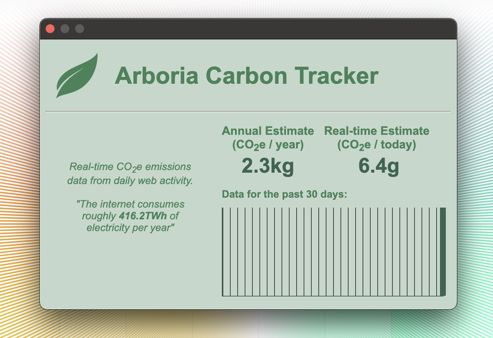

# Arboria Carbon Tracker

The environmental impact of our online activities is considerable, with each web page visited resulting in 0.80 grams of carbon emissions on average[1](#main-metric). This accumulation underscores the significant ecological footprint of digital consumption.

`Arboria` is a Chrome Browser extension, designed for monitoring and calculating the CO2e emissions from your daily browsing, offering a real-time audit of your digital carbon footprint.

## Features

- Real-time CO2e emissions data from daily web browsing.
- 30-day visual of your browsing emissions data.
- Annual CO2e emission forecast.

## Main Metric

carbonPerPage metric is based on data sourced from [HTTP Archive](https://httparchive.org/reports/page-weight#bytesTotal) by Website Carbon Calculator in July 2023

## The formulas for calculating digital emissions:

Energy per visit (E), where E = Data transfer per visit (new visitors) in GB x 0.81 kWh/GB x 0.75 + Data transfer per visit (returning visitors) in GB x 0.81 kWh/GB x 0.25 x 0.02
Emissions per visit in grams of CO2 (C) where C = E x 442g/kWh

Full methodology @ [Sustainable Web Design](https://sustainablewebdesign.org/calculating-digital-emissions/).

## Usage

- Browse the web as usual, and the extension will track the energy consumption of each webpage visited.
- Access Arboria by clicking on the extension icon in the Chrome browser toolbar.

## Algorithms

1. **Daily Carbon Emission Calculation:** This calculates the carbon emissions for the current day by multiplying the number of pages viewed today (`dayCount`)
   by the average carbon emissions per page view (`carbonPerPage`).

   `todayCarbon = dayCount * carbonPerPage`
   
2. **Average Daily Carbon Emission and Annual Forecast:** This calculates the average daily carbon emissions based on past data (`sum` of emissions over `days`) and
   then projects it to an annual scale.
   
   `average daily carbon: avgDay = sum / days`
   
   `annual forecast: annualEmission = avgDay * 365`

4. **Comparison to Flights and Trees Required:** This compares the annual forecasted emissions to the equivalent number of flights between New York and Los Angeles (`flight`)
   and calculates the number of trees required to offset the annual emissions (`treesNeeded`).
   
   `flightsEquivalent = annualEmission / flight`
   
   `treesNeeded = annualEmission / trees`

   The `sum` variable aggregates the total carbon for the `days` counted, and days keep track of the number of days with more than zero emissions.

## Future Updates 

1. Migrate from **Manifest V2 to Manifest V3.**

