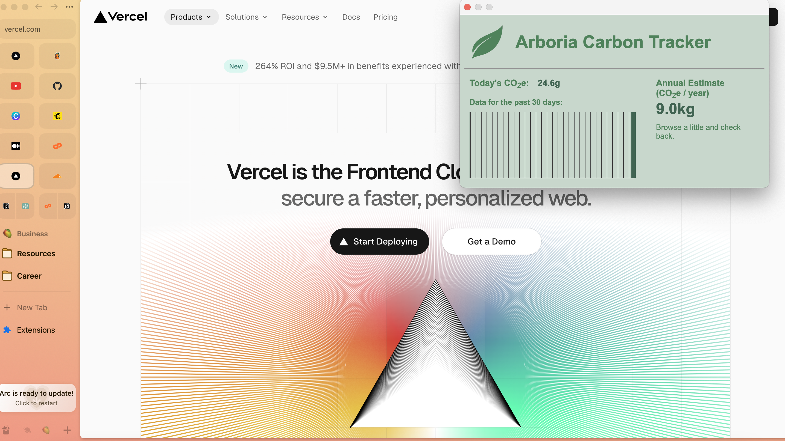
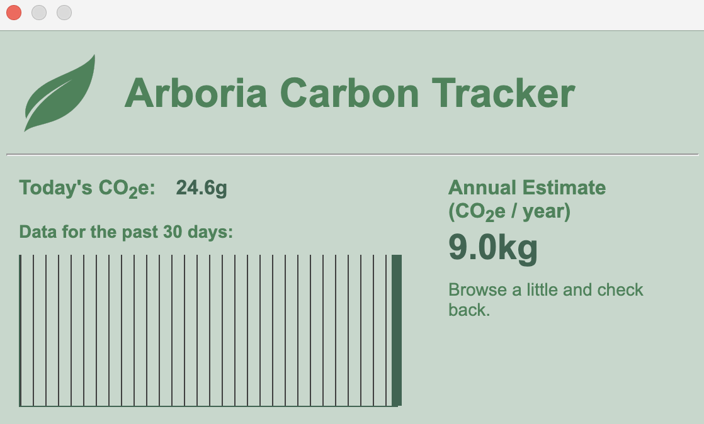

# Arboria Carbon Tracker

With every web page generating 1.76g of carbon emissions, the cumulative effect of our online activities becomes a significant environmental concern.

`Arboria` is a Chrome Browser extension, designed for tracking and calculating the CO2e emissions from your daily browsing, offering a real-time audit of your digital carbon footprint.

## The internet shouldn't cost the earth.

The inspiration for this project lies in a realization that the Internet's carbon footprint rivals that of the global aviation industry. 
Data centers, transmission networks, and the billions of devices we use are steadily guzzling electricity, primarily sourced from fossil fuels. 

With data on energy consumption by websites, users can more informed decisions by understanding the real weight of their online activities in carbon emissions 
and be part of a solution that aims for a greener internet.

## Features

1. Tracks ⏱️ real-time CO2e emissions from daily web browsing.
2. Displays a 30-day view 📊 of your browsing emissions.
3. Offers an annual CO2e emission forecast 🌧️ using average carbon emissions data.
4. Compares annual emissions to an equivalent number of flights 🛫.
5. Suggest the number of trees 🌴 to plant to offset emissions.

## Usage

- Browse the web as usual, and the extension will track the energy consumption of each webpage visited.
- Access Arboria by clicking on the extension icon in the Chrome browser toolbar.

## Algorithms

1. **Daily Carbon Emission Calculation:** This calculates the carbon emissions for the current day by multiplying the number of pages viewed today (`dayCount`)
   by the average carbon emissions per page view (`carbonPerPage`).

   `todayCarbon = dayCount * carbonPerPage`
   
2. **Average Daily Carbon Emission and Annual Forecast:** This calculates the average daily carbon emissions based on past data (`sum` of emissions over `days`) and
   then projects it to an annual scale.
   
   `average daily carbon: avgDay = sum / days`
   
   `annual forecast: annualEmission = avgDay * 365`

4. **Comparison to Flights and Trees Required:** This compares the annual forecasted emissions to the equivalent number of flights between New York and Los Angeles (`flight`)
   and calculates the number of trees required to offset the annual emissions (`treesNeeded`).
   
   `flightsEquivalent = annualEmission / flight`
   
   `treesNeeded = annualEmission / trees`

   The `sum` variable aggregates the total carbon for the `days` counted, and days keep track of the number of days with more than zero emissions. 

## Future Updates 

1. Migrate from **Manifest V2 to Manifest V3.**

